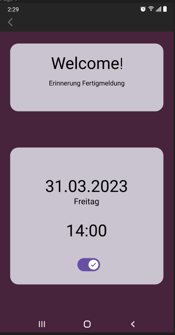
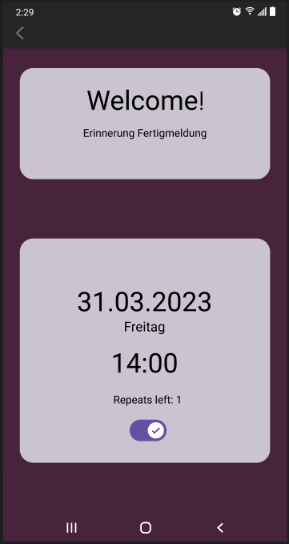
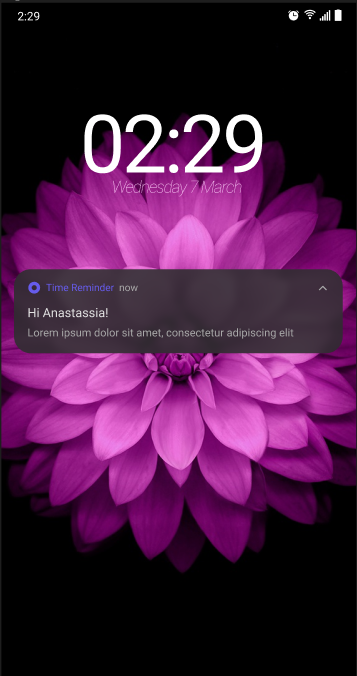

# Dokumentation üK 335

## Inhaltsverzeichnis

- ### [**1.0 Einleitung**](#10-einleitung-1)

  - #### [**1.1 Anforderungen**](#11-anforderungen-1)
  - #### [**1.2 Ziele**](#12-ziele-1)

- ### [**2.0 Mockups und Design**](#20-mockups-und-design-1)

- ### [**3.0 Umsetzung des projektes**](#30-umsetzung-des-projektes-1)

- ### [**4.0 Testing**](#40-testing-1)

---

## **1.0 Einleitung**

### **1.1** Anforderungen

Unsere Aufgabe für dieses Projekt ist es, eine Mobile Applikation zur Erinnerung der Fertigmeldung zu erstellen. In der App soll der Nutzer den gewünschten Tag für die Erinnerung einstellen können. Zusätzlich soll auch die gewünschte Zeit definert werden können. Wenn all dies definiert wurde, kann der Nutzer definieren, wie oft sich diese Message wiederhohlen soll.

### **1.2** Ziele

- Der Nutzer kann einstellen, an welchem Tag er die Erinnerung erhält
- Falls kein Tag definiert wurde, wird automatisch der letzte Tag in dem Monat genommen
- Der Nutzer kann eine bestimmte Zeit auswählen
- Der Nutzer bekommt eine Push-Benachrichtung am definerten Tag
- Es kann eine Anzahl von Wiederholungen ausgewählt werden
- Die Applikation wurde getestet

## **2.0** Mockups und Design

### Home page

Die unten dargestellte Seite, stellt das Muckup unserer Home Page dar. Auf dieser Seite wird als erstes ein kleiner Willkommenstext dargestellt. Weiter unten ist zu sehen, wann die nächste Erinnerung kommt. Falls der Nutzer nicht mehr zufrienden ist kann er auf den dargestellten Kasten klicken. Dann wird er auf die [nächste Seite](#selecting-page) weitergeleitet.

### Selecting Page

Die Selecting Page ist die Seite, auf der das Datum und die Uhrzeit der Erinnerung angepasst und definiert werden kann. Zusätzlich kann ausgewählt werden, wieviele Monate in Folge die Erinnerung kommt.

### Message

Die Message sollte ungefähr so aussehen, wie im Mochup, welches unten dargestellt wurde.

Link für Figma: https://www.figma.com/file/K5UEwmhLbN4sTiERp3Dpyk/Mockup-Time-reminder?node-id=0%3A1&t=BZooCcnTby7qsY0U-1

## **3.0** Umsetzung des projektes

---

## **4.0** Testing
