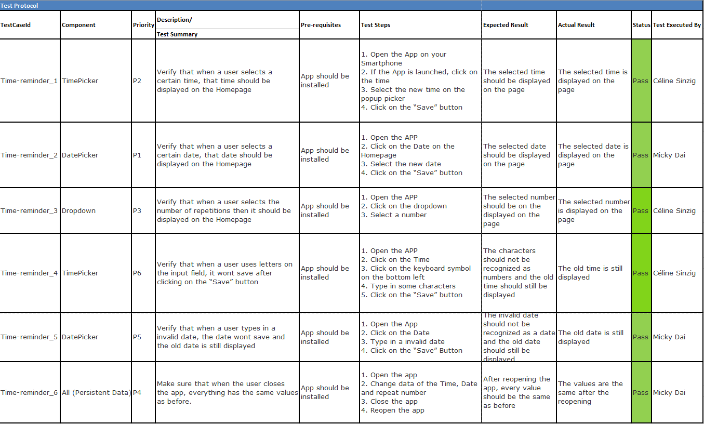

# Dokumentation üK 335

## Inhaltsverzeichnis

- ### [**1.0 Einleitung**](#10-einleitung-1)

  - #### [**1.1 Anforderungen**](#11-anforderungen-1)
  - #### [**1.2 Ziele**](#12-ziele-1)

- ### [**2.0 Mockups und Design**](#20-mockups-und-design-1)

  - #### [**2.1 Infrastruktur**](#21-infrastruktur-1)

- ### [**3.0 Code Dokumentation**](#30-code-dokumentation-1)

- ### [**4.0 Testing**](#40-testing-1)

---

## **1.0 Einleitung**

### **1.1** Anforderungen

Unsere Aufgabe für dieses Projekt ist es, eine Mobile Applikation zur Erinnerung der Fertigmeldung zu erstellen.

#### Funktionale Anforderungen

- Als ein Nutzer kann ich ein den Tag, an der die Nachricht kommt, angeben
- Als ein Nutzer kann ich die Zeit angeben, an welcher die Nachricht kommt
- Als ein User kann ich einstellen, wie oft dich die Nachricht wiederhohlt
- Wenn ich als Nutzer kein Tag angegeben habe, bekomme ich die Erinnerung am letzten Arbeitstag im Monat

#### Nicht-funktionale Anforderungen

- Als ein User finde ich das UI ansprechend
- Als ein User kann ich mich auf den Seiten zurechfinden

### **1.2** Ziele

Die User Stories sind fertig wenn:

- Der Nutzer einen bestimmten Tag für die Nachricht auswählen kann
- Der Nutzer die Zeit der Nachricht bestimmen kann
- Der Nutzer die Wiederhohlungen definieren kann
- Die Steuerelemente an den richtigen Stellen verwendet wurden
- Als Standart Tag der Letzte Arbeitstag im Monat genommen wird

## **2.0** Mockups und Design

### Home page

Die unten dargestellte Seite, stellt das Mockup unserer Home Page dar. Auf dieser Seite wird als erstes ein kleiner Willkommenstext dargestellt. Weiter unten ist zu sehen, wann die nächste Erinnerung kommt. Falls der Nutzer nicht mehr zufrienden ist, kann er das Datum und die Uhrzeit der Erinnerung ändern.


Falls das Datum oder die Uhrzeit geändert werden soll, kann das mit einem einfachen Klick gemacht werden. Mit einem Klick auf das Datum wird erscheint ein Popup eines Kalenders. Das gleiche gilt für die Zeit. Wir entschieden uns dazu, für die Komponenten kein Mockup zu erstellen, da wir nicht viel am Desing beitragen.

Link für Figma: https://www.figma.com/file/K5UEwmhLbN4sTiERp3Dpyk/Mockup-Time-reminder?node-id=0%3A1&t=BZooCcnTby7qsY0U-1

### **2.1** Infrastruktur

In unserem Projekt arbeiten wir mit React Native TS und Expo. Diese Auswahl wurde nicht von uns getroffen, sondern war vorgschrieben. Jedoch haben wir uns als Components Library für React Native Paper entschieden. Diese Library hat alle wichtigen Komponente, welche wir für dieses Projekt brauchen. Die Mockups wurden mit Figma erstellt, da wir schon etwas erfahrung mit Figma hatten.

### Installation

#### Prerequisites

- [Node.js](https://nodejs.org/en/)
- emulator or device

#### Run the project

```bash
$ npm i
$ npm run android
```

## **3.0** Code Dokumentation

Da eine gute Code Dokumentation verlangt wird, wird user Code mit TSDocs kommentiert. Für all unsere wichtigsten Funktione wurden ein paar Kommentare geschrieben, welche dem leser helfen, den Code besser zu verstehen.

## **4.0** Testing



---
